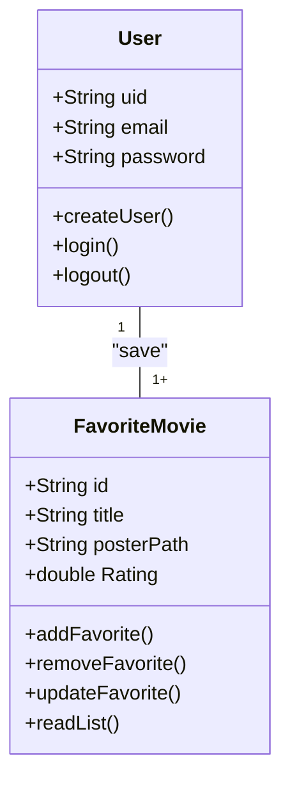

# CineFavorite - Formativa
Construir um Aplicativo do Zero - O CineFavorite permitirá criar uma conta e buscar filmes em uma API e montar uma galeria pessoal de filmes favoritos, com posters e notas

## Objetivos
- Criar uma Galeria Personalizada por Usuário de Filmes Favoritos 
- Conecar o APP com uma API( base de Dados) de Filmes
- Permitir a Criação de Contar para Cada Usuário
- Listar Filmes por Palavra-Chave


## levantamento de Requistos do Projeto
- ### Funcionais 

- ### não Funcionais

## Recursos do Projeto
- Flutter /Dart
- FireBase ( Authentication / FireStore DataBase)
- API TMDB
- Figma
- VsCode

## Diagramas

1. ### Classes
    Demonstrar o Funcionamento das Entidades do Sistema
    - Usuario (User) : classe já modela pelo FirebaseAuth
        - email
        - password
        - uid
        - login()
        - create()
        - logout()

    - FilmeFavorito: Classe modelada pelo DEV
        - number:id
        - String: Título
        - String: Poster
        - double: Rating
        - adicionar()
        - remover()
        - listar()
        - updateNota()


2. ### Uso
 Açoes que os Atores podem fazer
  - User: 
  - Registar 
  - Login
  - logout 
  - Procurar Filems API
  - Salvar Filems API
  - Dar Not aos Filems 
  - Remover dos Favoritos
 
 ```mermaid
graph TD
    subgraph "Ações"
        uc1([Register])
        uc2([Login])
        uc3([LogOut])
        uc4([Search Movie])
        uc5([Favorite Movie])
        uc6([Rating Movie])
        uc7([Remove Favorite Movie])
    end

    user --> uc1
    user --> uc2
    user --> uc3
    user --> uc4
    user --> uc5
    user --> uc6
    user --> uc7


    uc1 --> uc2
    us2 --> uc3
    us2 --> uc4
    us2 --> uc5 
    us2 --> uc6
    us2 --> uc7 
    
```


3. ### Fluxo
 Determine o Caminho percorrido pelo aTor para execuar ação 


- Ação de Login


``` mermaid 
A[iniciio] --> b {Login Usuari}

    A[Ínicio] --> B {Login Usuário}
    B --> C[Inserir Email e Senha] 
    C --> D{Validar as Credenciais}
    D--> E[Sim]
    E --> F[Tela de Favoritos]
    D--> G[Não]
    G --> 

```


## Prototipagem

## Codificação