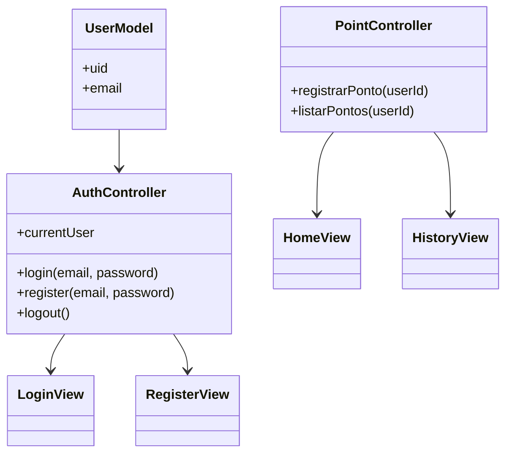
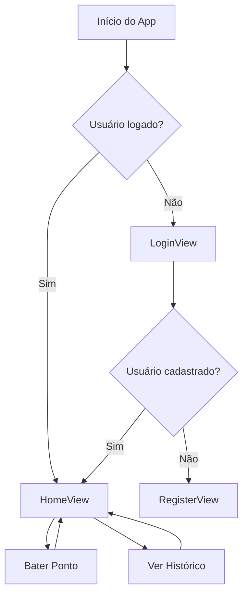

# App Registro de Ponto - Flutter + Firebase

Aplicativo mobile simples de registro de ponto para funcionários, com **Firebase Authentication**, **Firestore** e **geolocalização**, desenvolvido em **Flutter** seguindo o padrão **MVC**.  
Tema principal: **azul e branco**.

---

## ⚙️ Funcionalidades

- Login e cadastro de usuários via email e senha (Firebase Authentication).  
- Registro de ponto com **data, hora e geolocalização** (Firestore).  
- Histórico de pontos registrado pelo usuário.  
- Tema azul e branco, interface simples e responsiva.  

---

## 📌 Requisitos Funcionais

| Funcionalidade           | Requisito                                                             | Prioridade | Observações                                       |
| ------------------------ | --------------------------------------------------------------------- | ---------- | ------------------------------------------------- |
| **Registrar Conta**      | O usuário deve poder criar uma conta usando email e senha             | Alta       | Criação de conta única no Firebase Authentication |
| **Login**                | O usuário deve poder fazer login com email e senha                    | Alta       | Garantir acesso seguro ao app                     |
| **Registrar Ponto**      | O usuário deve registrar ponto com latitude, longitude e timestamp    | Alta       | Dados salvos no Firebase Firestore                |
| **Visualizar Histórico** | O usuário deve visualizar histórico de pontos previamente registrados | Alta       | Exibição clara e organizada em lista              |
| **Sincronização**        | O app deve sincronizar os dados em tempo real com Firebase Firestore  | Alta       | Garantir informações atualizadas                  |

---

## 📌 Requisitos Não Funcionais

| Categoria                |Requisito                                                                 | Prioridade | Observações |
|---------------------------|---------------------------------------------------------------------------|------------|-------------|
| **Performance**           | O aplicativo deve ser leve e rápido, carregando telas em menos de 2s      | Alta       | Testar em emulador e dispositivo real |
| **Interface (UI/UX)**     | A navegação deve ser intuitiva e responsiva                                | Alta       | Tela inicial, login, cadastro, home e histórico |
| **Segurança**             | Autenticação segura via Firebase Authentication                           | Alta       | Usuários devem autenticar antes de registrar pontos |
| **Arquitetura**           | Seguir padrão MVC para fácil manutenção e extensibilidade                  | Média      | Separar controllers, views e models |
| **Compatibilidade**       | Suportar dispositivos Android com versão >= 8.0                            | Média      | Testar em diferentes tamanhos de tela |
| **Confiabilidade**        | Dados devem ser sincronizados corretamente com Firestore em tempo real     | Alta       | Inclui registro de pontos e histórico |
| **Usabilidade**           | Feedback visual para ações importantes (ex: ponto registrado com sucesso) | Alta       | SnackBars, cores e ícones para destaque |
| **Escalabilidade**        | Estrutura do app deve permitir inclusão futura de biometria ou QR Code    | Média      | Preparar controllers e models para expansão |
 

---

## 📊 Diagramas

### 1️⃣ Diagrama de Classes (MVC Mobile)

