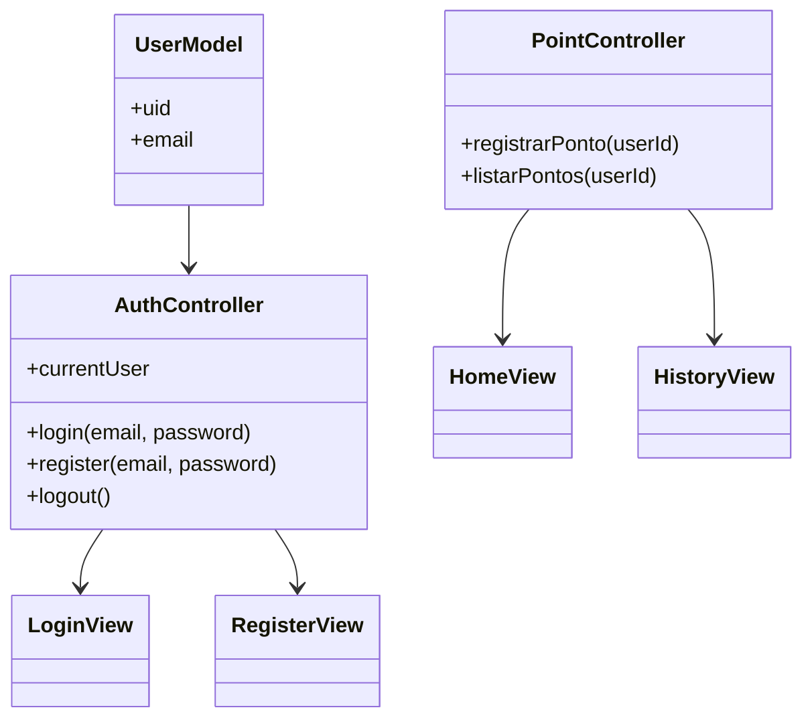
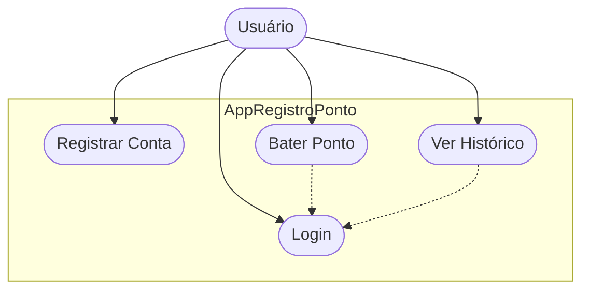
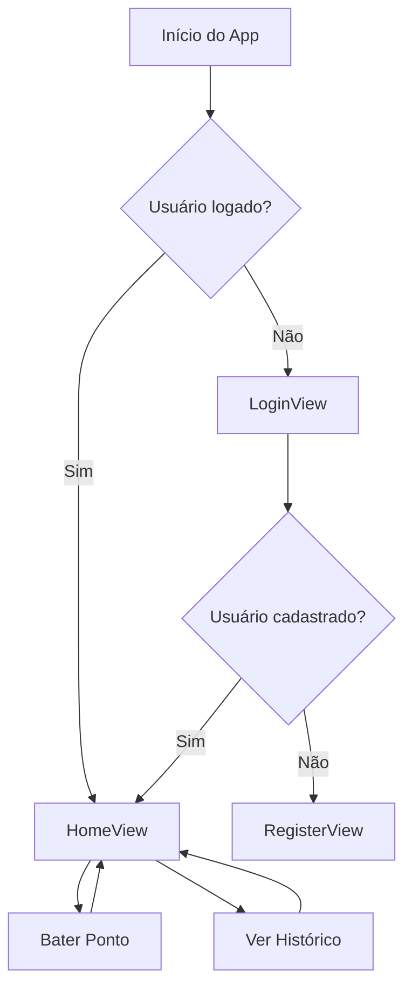

# App Registro de Ponto - Flutter + Firebase

Aplicativo mobile simples de registro de ponto para funcionários, com **Firebase Authentication**, **Firestore** e **geolocalização**, desenvolvido em **Flutter** seguindo o padrão **MVC**.  
Tema principal: **azul e branco**.

---

## ⚙️ Funcionalidades

- Login e cadastro de usuários via email e senha (Firebase Authentication).  
- Registro de ponto com **data, hora e geolocalização** (Firestore).  
- Histórico de pontos registrado pelo usuário.  
- Tema azul e branco, interface simples e responsiva.  

---

## 📌 Requisitos Funcionais

1. O usuário deve poder **registrar-se** usando email e senha.  
2. O usuário deve poder **fazer login** com email e senha.  
3. O usuário deve **registrar ponto** com latitude, longitude e timestamp.  
4. O usuário deve poder **visualizar histórico de pontos** registrados.  
5. O aplicativo deve **sincronizar os dados com Firebase Firestore** em tempo real.  

---

## 📌 Requisitos Não Funcionais

1. Interface **responsiva** em dispositivos Android.  
2. Aplicativo **leve e rápido** para uso diário.  
3. Navegação **simples e intuitiva**.  
4. Autenticação segura via **Firebase Authentication**.  
5. Arquitetura **MVC** para fácil manutenção.  

---

## 📊 Diagramas

### 1️⃣ Diagrama de Classes (MVC Mobile)

