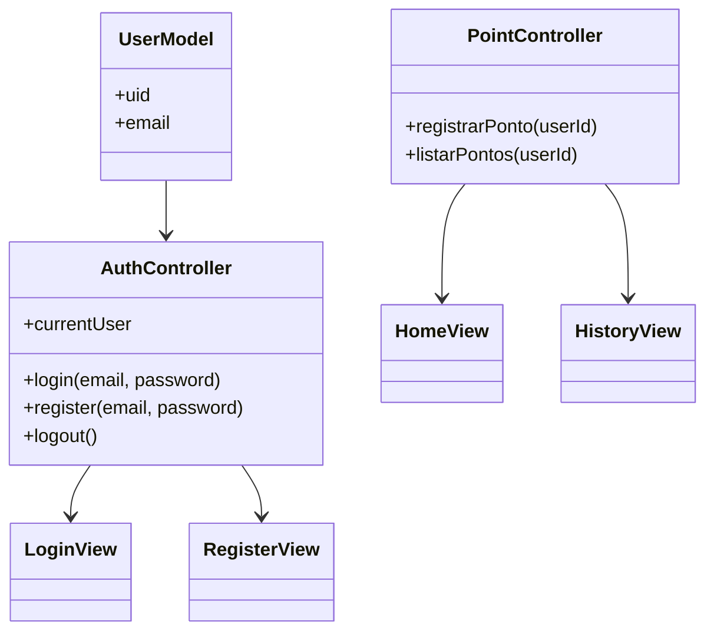

# App Registro de Ponto - Flutter + Firebase

Aplicativo simples de registro de ponto para funcionários, com **Firebase Authentication**, **Firestore** e **geolocalização**, desenvolvido em **Flutter** seguindo o padrão **MVC**.  
Tema principal: **azul e branco**.

---

## ⚙️ Funcionalidades

- Login e cadastro de usuários via email e senha (Firebase Authentication).  
- Registro de ponto com **data, hora e geolocalização** (Firestore).  
- Histórico de pontos registrado pelo usuário.  
- Tema azul e branco, interface simples e responsiva.  

---

## 📌 Requisitos Funcionais

1. O usuário deve poder **registrar-se** usando email e senha.  
2. O usuário deve poder **fazer login** com email e senha.  
3. O usuário deve **registrar ponto** com latitude, longitude e timestamp.  
4. O usuário deve poder **visualizar histórico de pontos** registrados.  
5. O aplicativo deve **sincronizar os dados com Firebase Firestore** em tempo real.  

---

## 📌 Requisitos Não Funcionais

1. A interface deve ser **responsiva** em dispositivos Android.  
2. O app deve ser **rápido** e **leve** para uso diário.  
3. A navegação deve ser **simples** e **intuitiva**.  
4. Os dados sensíveis do usuário devem ser **autenticados via Firebase Authentication**.  
5. A arquitetura deve seguir o padrão **MVC** para facilitar manutenção e evolução.  

---

## 📊 Diagramas

### 1️⃣ Diagrama de Classes




```mermaid
%%Diagrama de Casos de Uso
usecaseDiagram
    actor Usuario
    Usuario --> (Registrar Conta)
    Usuario --> (Login)
    Usuario --> (Bater Ponto)
    Usuario --> (Ver Histórico de Pontos)
```

 ```mermaid
%% Diagrama de Fluxo Principal
flowchart TD
    A[Início do App] --> B{Usuário logado?}
    B -- Não --> C[LoginView]
    B -- Sim --> D[HomeView]
    C --> E{Usuário cadastrado?}
    E -- Não --> F[RegisterView]
    E -- Sim --> D[HomeView]
    D --> G[Bater Ponto]
    D --> H[Ver Histórico]
    G --> D
    H --> D
 ```

